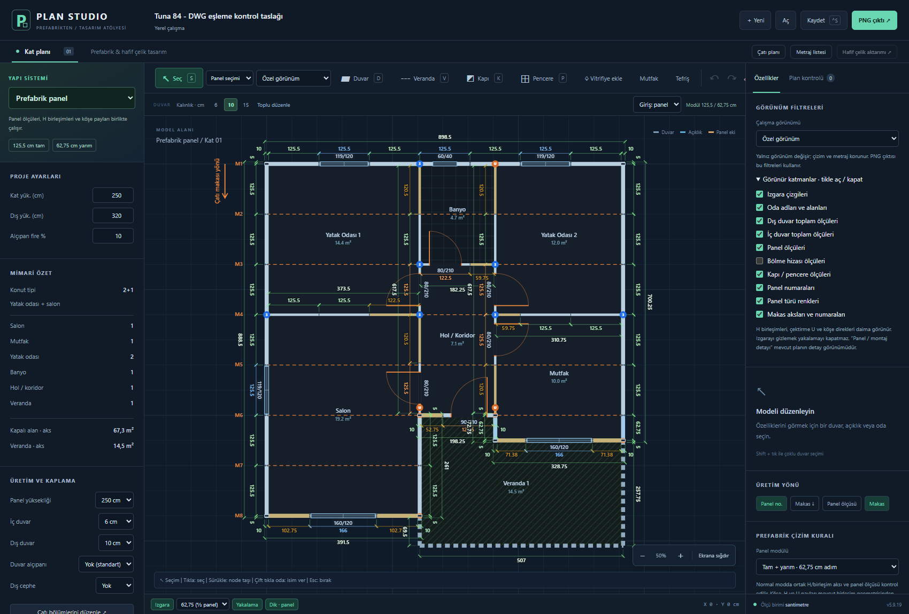

# Drawing1.dwg ↔ iş bilgisayarı planı — ölçülü karşılaştırma

2 Ekim 2026 · Prefabrikten Plan Studio 5.9.19

**Sonuç:** İş JSON'u aynı yapının eksik bir aşamasıdır; yalnız giriş paneli farkı yoktur. Ana dış duvar geometrisi eşleşir. Eksik bölmeler, açıklıklar ve veranda ile farklı panel dizilimleri ayrı bir kontrol taslağında tamamlandı. Bu dosya henüz imalata verilmiş/onaylanmış bir çıktı değildir.

## Kaynaklar ve kullanıcı kararları

- İmalat planı: [Drawing1.dwg](../referanslar/tuna-84m2/Drawing1.dwg).
- Karşılaştırılan kayıt: [iş JSON'u](../cizimler/2026-10-02-is-kayit-5.json). Kullanıcı bu kaydı karşılaştırma hedefi olarak açıkça belirledi; ev JSON'u kullanılmadı.
- Sonuç: [DWG eşleme kontrol taslağı](../cizimler/2026-10-02-tuna84-dwg-esleme-taslak.json).
- Ölçü kanıtları ve CAD nesne kimlikleri: [geometri](2026-10-02-drawing1-geometri.json). Duvar bazında önce/sonra ve kalan uyarılar: [karşılaştırma verisi](2026-10-02-tuna84-karsilastirma.json).
- Kullanıcı panel yüksekliğini **250 cm** olarak belirledi. Kontrol kaydında panel ve kat yüksekliği 250 cm yapıldı; çatı/alın için ayrı dış yükseklik 320 cm değişmedi, bu değer bu karşılaştırmada doğrulanmadı.
- Kullanıcı kapı ölçülerinin bu aşamada mevcut programdaki gibi kalmasını istedi. Mevcut e144 dış kapısının tüm kaydı (90 × 210, konum, yön, menteşe) aynen korundu. Eksik beş iç kapı 80 × 210 cm plan sembolü olarak ilgili CAD panolarının merkezine eklendi. Bunlar ölçülmüş kasa/kesim boşluğu değildir; yükseklikleri DWG planından çıkarılmadı.
- Orijinal DWG ve iş/ev JSON kayıtları değiştirilmedi. Canlı tarayıcı planına müdahale edilmedi.

## Ölçek ve koordinat eşleme

AutoCAD 2021 yerel Core Console okuyucusu ile geçici DWG kopyası okundu. Koordinatlar 12 ondalıkla çıkarıldı. Pencere blokları yalnız kaydedilmeyen geçici kopyada açıldı.

DWG `INSUNITS=4` (mm) bildiriyor; fakat geometrik panel boyları 125,5, kalınlıklar 10/6 ve dış toplam 898,5 çizim birimi. Metinlerdeki 1250/1200/520 gibi kesim değerleri mm'dir. Dolayısıyla bu çizimin geometrik koordinatları **cm ölçeğinde** yorumlandı; DWG birim ayarı değiştirilmedi.

Eşleme: `JSON x = CAD x − 1485,330993541329`; `JSON y = 1948,891426735070 − CAD y`. Ölçek 1; yalnız öteleme ve ekran Y yönü dönüşümü var. Dış üst köşe ve karşı köşe ile modüller kontrol edildi. Dış toplam genişlik 898,5 cm; kapalı kısmın en büyük dış derinliği 888,5 cm. Veranda dâhil dış derinlik 963 cm.

## Farklar ve yapılanlar

| Konu | İş JSON'u | CAD referansı / kontrol taslağı |
| --- | --- | --- |
| Ana dış duvar aksları | Mevcut | Aynı; mevcut düğüm koordinatlarının tamamı korundu |
| Salon–hol bölmesi | 251 cm aks hattı eksik | x=695,25 üzerinde y=62,75…313,75 tamamlandı; iki pano |
| Banyo–hol bölmesi | 188,25 cm aks hattı eksik | y=−62,75 üzerinde x=695,25…883,5 eklendi; 122,5 + 59,75 cm |
| Giriş cephesi e142 | 57,75 + 120,5 | **52,75 + 125,5 cm**; toplam 178,25 korunur; BC9/B3C |
| Mutfak alt cephesi e100 | 57,75 + 125,5 + 125,5 | **71,375 + 166 + 71,375 cm**; BCC/AD0/802 |
| Salon alt cephesi e135 | 125,5 + 125,5 + 120,5 | **102,75 + 166 + 102,75 cm**; 7FB/AD5/7FD |
| Hol sol bölmesi | Üst kısım var, alt kısım yok | Üstten alta 120,5 + 125,5 + 125,5 + 120,5 + 125,5; CAD birleşim sırası |
| Pencereler | 0 | 3 × 119/120, 2 × 160/120, 1 × 60/40; CAD yazılı ölçüleri ve blok konumları |
| Kapılar | 1 dış kapı | Mevcut dış kapı + 5 iç kapı sembolü; gerçek kasa kesimleri bu aşamada eşlenmedi |
| Mekânlar | 4 kapalı alan | 6 kapalı alan (2 yatak, salon, mutfak, banyo, hol) + veranda |
| Veranda | Yok | Üç açık sınır; ön aks 507 cm, sağ aks 262,75 cm, sol açık uzatma 74,5 cm |
| Panel/kat yüksekliği | 280 cm | Kullanıcı kararıyla 250 cm |
| Pano yuvaları | 45 | 49 geometrik yuva; bu sayı Excel ürün satırlarıyla eşitlenmiş imalat listesi değildir |

JSON duvar segmenti sayısı 17'den 21 kapalı duvar segmentine ve 3 veranda sınırına çıktı. Artışın ikisi yeni T birleşimlerinde mevcut duvarların bölünmesidir; üst üste duvar eklenmedi.

Pencere bloklarında standart geometrik boşluk 120 cm, etiket 119 cm; kontrol planında kullanıcıya görünen açıklık ölçüsü olarak **119** korundu. Panel zarfı 125,5 cm'dir. Geniş pencerelerde zarf 166 cm, etiket 160 cm'dir. Bu farklar PVC sipariş ölçüsüyle karıştırılmamalı.

## Çizimdeki küçük geometrik sapmalar

CAD 806 dikdörtgeni ortak duvar aksından yaklaşık 0,1514 cm (1,514 mm) kaymış; 807 aynı bölgede hafif konik, 811 yaklaşık 0,0757 cm eğri. Kontrol taslağında ortak yatay/dikey aksa oturtuldu; 806/807 birleşimi 183,25 cm JSON Y konumunda tutuldu. Diğer koordinatlar 0,001 cm duyarlılıkla saklandı; 71,375 cm iki yan panel birbirinden farklı yuvarlanmadı. Bu küçük kaynak sapmaları birebir eğik imalat parçası olarak üretilmedi.

## Kesim eşlemeleri

Programın sınırlı kesim kataloğuna yalnız CAD'de açık etiketi bulunan eşlemeler eklendi:

| Yerleşim (cm) | Kesim etiketi (mm) | Kanıt |
| --- | --- | --- |
| 52,75 | 520 | BC9 paneli, BCB etiketi |
| 71,375 | 710 | BCC paneli, BCD etiketi; karşı tarafta ACD |
| 102,75 | 1020 | 7FB/7FD, ACE/ACF etiketleri |
| 166 | 1660 | AD0/AD5 pencere blokları, AD3/AD8 etiketleri |

Bu bir sabit pay çıkarma formülü değildir. Diğer tanımsız ölçüler için kesim tahmin edilmez. Yalnız bu eşlemelerin eklenmesi tam malzeme/imalat listesi üretiminin tamamlandığı anlamına gelmez.

## Açık kalan üretim kontrolleri

1. **e107 hattında bir makas/H mesnet uyumsuzluğu var.** CAD'deki 5 cm farklı birleşim sırasını korumak programın düzenli makas aksıyla çakışıyor. Referansa uysun diye makas sessizce taşınmadı; bağlantı/mesnet çözümü gerekli.
2. CAD özel panel genişlikleri ve aksları programın tam/yarım modül kontrolünde uyarı üretir. Uyarılar gizlenmedi veya otomatik bastırılmadı. Kalan 14 uyarı karşılaştırma JSON'unda kayıtlıdır; hepsi fiziksel hata olarak yorumlanmamalı.
3. Önceki Excel raporundaki 47 pano ile burada sayılan 49 geometrik yuva farklıdır. Excel ürün sınıfları ve DWG nesneleri satır bazında eşlenmeden doğru sipariş adedi ilan edilmez.
4. Kapı yayları yaklaşık 97,62 birimken etiketler 80/90'dır. Kullanıcının kararıyla kapı ölçüsü incelemesi ertelendi. Mevcut dış kapı yeni panelin geometrik merkezinden 2,5 cm farklı konumda kalır; kaydı aynen korundu.
5. Veranda için kat planı sınırı eşlendi. 10 × 10 cm direkler, kiriş kesimleri, elektrik/priz/anahtarlar, ıslak hacim donatısı, çatı ve üretim yükseklikleri bu dosyada tam model olarak üretilmedi. Kaynakta var olmaları sistemde hesaplandıkları anlamına gelmez.
6. Taslağın bağımsız `panelSync=false` ayarı CAD'deki özel birleşimleri korur. Çalışma sırasında yeniden otomatik eşleme seçilirse bu özel düzenler ayrıca kontrol edilmelidir.

## Doğrulama ve tekrar üretim

`node tools/compare-tuna84.cjs` orijinal iş JSON'undan ve ölçü kanıtından taslağı/karşılaştırma tablosunu tekrar üretir. Genel DWG içe aktarıcı değildir. Kaynak DWG SHA-256, bütün CAD pano kimliklerinin eşlenmesi, 49 yuva, 6 pencere/6 kapı/7 mekân, değişmeyen eski düğümler ve dış kapı, 250 cm, yapısal hata kontrolü ve JSON tekrar açıldığında pano/açıklık korunması doğrulanır. Normalleştirme kararları betikte açıktır.

5.9.19 için dağıtım dosyası üretildi; prefab testleri **77/77**, temel testler **31/31** geçti. Özgün kaynak dosyaların hash kontrolü de yapılır. Bu kontroller geometrik/veri tutarlılığı içindir; montaj veya taşıyıcı yeterlilik onayı değildir.

## Açma

Mevcut çizimi önce Kaydet ile koru. Plan Studio 5.9.19'da **Aç** üzerinden `cizimler/2026-10-02-tuna84-dwg-esleme-taslak.json` dosyasını seç. Orijinal iş JSON'u ayrı durur. Yalnız sayfayı yenilemek bu taslağı yüklemez.
